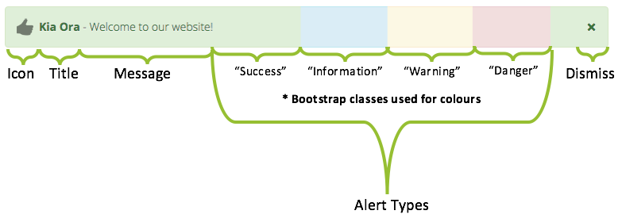

## Allows for notifications to be easily managed and set to be displayed to users

This block allows users to display DEFCON-like alerts, which are Bootstrap-based, allowing for various configurations.
This could be useful in cases such as alerting users of scheduled outages, welcoming them to your site, teachers can use it to notify users of changes/due dates, etc.

### Features:

* Customisable title & message
* Basic HTML tags allowed for advanced users
* Multi-lingual/filter support
* Multiple types of notifications (Bootstrap-based)
* Type-based icons (optional setting)
* Dismissible/Non-Dismissible
* Customisable date range to show notifications
* Display a notification to the user a set amount of times
* Instance-based or global/site-wide notifications
* Enable/Disable a/all notifications (Site-wide and instance-based)
* Edit/Delete/Restore notifications
* Option to auto-delete notification after end date
* Option to permanently delete notifications that's had the deleted flag for more than 30 days
* Option to automatically remove user (dismissed/seen) records that relates to notifications that don't exist anymore
* AJAX used to improve user-experience and simplify processes
* Live-preview when making/editing a notification
* Easy to use, but fully documented with all the nitty-gritty information
* Implements Privacy API (GDPR Compliance)

For full documentation, please check [here](docs/AdvancedNotifications.pdf) - or check the plugin's `/docs` directory.

#### Notification Anatomy

#### Installation Notice

All the plugin's settings are disabled by default. Enable it upon installation if you wish to start using it immediately or enable it later by navigating to Site Administration > Plugins > Blocks > Advanced Notifications. 

#### Backwards Compatibility/Progressive Enhancement

Although the plugin works and is usable without JavaScript, it is highly recommended to use the plugin with JavaScript enabled.
Using the plugin with JavaScript disabled does not allow for some features to be used to their full potential ranging from dismissing a notification to dynamically editing existing notifications and the live-preview feature - all of which relies on JavaScript in some form to make the user's experience more enjoyable.

#### Pull Requests

Pull requests are welcome - submit pull requests to address issues, add features, fix typos, anything!

#### TODO:

* Allow user that created notification to delete the notification.
* Add time (hh:mm) to 'From/To' setting.